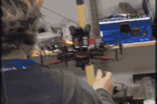

# roslibsurvive

ROS wrapper of [libsurvive](https://github.com/cnlohr/libsurvive) for getting position from HTC Vive Tracker.




[Positioning Test (YouTube video)](https://youtu.be/a5dJ0t4Btc4)

[Offboard Flight Test (YouTube video)](https://youtu.be/_Jx_HtfYyl8)

## Manual installation

Install [clever](https://github.com/copterexpress/clever) package for copter control if needed, or [download](https://github.com/CopterExpress/clever/releases/latest) image for Raspberry Pi

Install dependencies needed for libsurvive:

```bash
sudo apt-get install liblapacke-dev libopenblas-dev libatlas-base-dev libusb-1.0-0-dev libpcap-dev
```

Clone this git repository to separate catkin workspace:

```bash
mkdir -p ros_catkin_ws/src
cd ~/ros_catkin_ws/src
git clone https://github.com/sfalexrog/roslibsurvive.git

```

Build ROS packages (on memory constrained platforms you might be going to need to use `-j1` key):

```bash
cd ~/ros_catkin_ws
catkin_make -j1
```

## Running

Enable systemd service `roscore` (if not running):

```bash
sudo systemctl enable /home/<username>/catkin_ws/src/clever/deploy/roscore.service
sudo systemctl start roscore
```

Calibrate the system. Put calibration file (config.json) from our repo (with necessary settings but without calibration data) to ~/.ros/ directory and start node. Stop node after the end of calibration process. You should recalibrate the system if the position of one of the lighthouses changes.

```bash
cp ~/ros_catkin_ws/src/roslibsurvive/config.json ~/.ros
roslaunch roslibsurvive simple.launch
```

Start the node for autonomous drone control. It will publish HTC Vive Tracker pose to /mavros/vision_pose/pose and run simple_offboard service from clever package to controll the drone autonomously:

```bash
roslaunch roslibsurvive direct.launch
```

Main parameters for the roslibsurvive_frame_publisher are:
vive_base_frame_id - pose and frame header id;
static_yaw, static_pitch, static_roll - rotation of Vive Tracker relative to flight controller board.

The result pose and frame are published as "~T20_pose_t1" and "T20" respectively.

You can use vive_tracker.rviz file as settings for rviz to watch that you setup the correct position of tracker.
